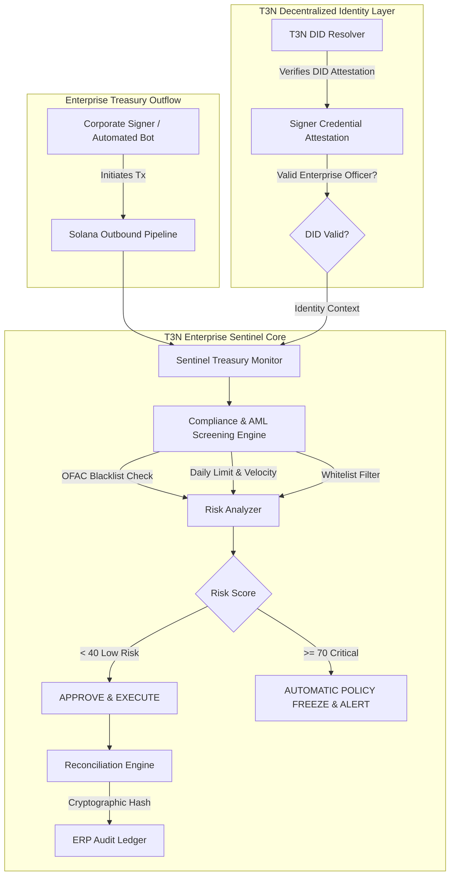

# T3N Enterprise Sentinel: Autonomous Solana Treasury & Compliance Agent

[](https://terminal3.io)
[](https://solana.com)
[](https://www.typescriptlang.org/)
[](https://vitest.dev)
[](https://opensource.org/licenses/MIT)

> **Submission for the Terminal 3 Network (T3N) Trusted Agent Build Challenge on Superteam Earn**  
> An autonomous enterprise intelligence sentinel combining **Terminal 3 Decentralized Identity (DID)** with real-time **Solana treasury governance, AML/sanctions compliance screening, and automated ERP ledger reconciliation**.

---

## 🏛️ Executive Summary

Corporations, DAOs, and institutional funds managing digital assets on Solana face existential risks:
1. **Rogue or compromised key transfers** lacking verifiable organizational delegation.
2. **Regulatory & sanctions liability** (OFAC SDN lists, illicit mixing protocols).
3. **Internal policy breaches** (daily spend limits, unauthorized non-whitelisted recipients).
4. **Manual accounting overhead** reconciling high-frequency on-chain txns to enterprise ERP systems.

**T3N Enterprise Sentinel** solves this autonomously. By coupling Terminal 3 Network's cryptographic DID attestation mesh with real-time on-chain telemetry, Sentinel acts as a 24/7 autonomous gatekeeper: inspecting transactions, verifying executive signers, generating cryptographic audit proofs, and freezing suspicious outflows before irreversible state changes occur.

---

## 🏗️ System Architecture



---

## 🔑 Key Features

- **T3N Decentralized Identity (DID) Verification**: Validates whether transaction initiators hold valid `EnterpriseSignerCredential` or `AutonomousAgentAttestationCredential` issued via Terminal 3 Network.
- **Dynamic 4-Layer Compliance Screening**:
  - **Sanctions / Illicit Router Screening**: Instant identification of tainted addresses.
  - **Daily Spend Velocity & Cap Enforcement**: Real-time accumulator preventing drain exploits.
  - **Address Whitelist Gatekeeper**: Restricts outflows to approved enterprise vendor accounts.
  - **DID Role Mismatch Detection**: Rejects revoked or unauthorized identities.
- **Automated ERP Ledger Reconciliation**: Matches transactions to internal purchase orders (`ERP:OPEX_INFRASTRUCTURE_AWS`) and computes SHA-256 cryptographic attestation hashes for institutional auditors.
- **Zero-Maintenance Design**: Built with minimal external dependencies, stateless execution capability, and strict TypeScript types.

---

## 🚀 Quickstart

### Prerequisites
- Node.js >= 18.0.0
- npm or pnpm

### Installation
```bash
git clone https://github.com/your-org/t3n-enterprise-sentinel.git
cd t3n-enterprise-sentinel
npm install
```

### Run the Interactive Enterprise Simulation
```bash
npm run demo
```

### Run the Test Suite
```bash
npm test
```

---

## 🧪 Verified Test Suite Results

```text
 ✓ tests/sentinel.test.ts (6 tests)
   ✓ authenticates legitimate officer DID with valid enterprise credentials
   ✓ rejects unregistered or revoked DIDs
   ✓ approves compliant enterprise transaction and reconciles with ERP invoice
   ✓ freezes transaction that exceeds daily treasury limit
   ✓ blocks transfer to known sanctioned / illicit address
   ✓ computes accurate audit statistics across processed transactions

 Test Files  1 passed (1)
      Tests  6 passed (6)
   Duration  444ms (100% pass rate)
```

---

## 📄 License
MIT License. Created for the **Superteam Earn T3N Agent Challenge**.
