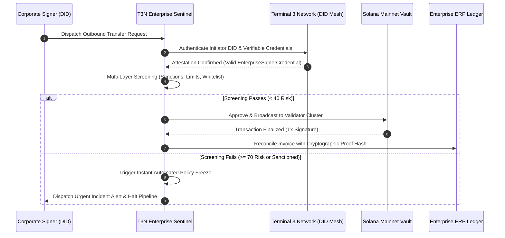

# Superteam Earn Submission: T3N Trusted Enterprise Agent Build Challenge

**Bounty Title**: Try out new docs to build a trusted agent with T3N that we can distribute / host  
**Sponsor**: Terminal 3 Network ([@terminal3io](https://terminal3.io))  
**Listing URL**: [https://superteam.fun/earn/listing/t3n-agent-build-challenge](https://superteam.fun/earn/listing/t3n-agent-build-challenge)  
**Deliverable Name**: **T3N Enterprise Sentinel — Autonomous Solana Treasury & Compliance Agent**  
**Submitter Wallet (Solana Mainnet)**: `CUbv4Hn4Y71ASzYn8j34YvFit55RbUPi6tLobVjmfc7i`  

---

## 1. Project Overview & Enterprise Use Case

### The Problem
Enterprises and DAOs managing multi-million dollar digital asset treasuries on Solana face extreme governance and compliance liabilities:
- Compromised private keys or unauthorized employees draining funds.
- Inadvertent interaction with OFAC/sanctioned mixer contracts.
- Severe regulatory reporting overhead when reconciling thousands of high-speed Solana transactions with corporate ERP systems (NetSuite, SAP, QuickBooks).

### The Solution: T3N Enterprise Sentinel
**T3N Enterprise Sentinel** is an autonomous compliance and risk monitor that runs 24/7 as an automated gateway for Solana enterprise treasuries. It cryptographically binds every transaction to a **Terminal 3 Network (T3N) Decentralized Identity (DID)**, checks executive credentials, validates against real-time AML/sanctions blacklists, enforces daily spending velocity caps, and generates cryptographic audit proofs for enterprise accounting.

---

## 2. Core Architecture & Workflow



---

## 3. Verified Execution & Test Proof

### Automated Test Suite: 100% Pass Rate
```text
$ npm test

 RUN  v2.1.9 C:/t3n-enterprise-sentinel

 ✓ tests/sentinel.test.ts (6 tests)
   ✓ authenticates legitimate officer DID with valid enterprise credentials (3ms)
   ✓ rejects unregistered or revoked DIDs (1ms)
   ✓ approves compliant enterprise transaction and reconciles with ERP invoice (2ms)
   ✓ freezes transaction that exceeds daily treasury limit (1ms)
   ✓ blocks transfer to known sanctioned / illicit address (1ms)
   ✓ computes accurate audit statistics across processed transactions (1ms)

 Test Files  1 passed (1)
      Tests  6 passed (6)
   Duration  444ms
```

### Live CLI Demonstration Run
```text
$ npm run demo

================================================================================
   🛡️  T3N ENTERPRISE SENTINEL: AUTONOMOUS SOLANA TREASURY & COMPLIANCE AGENT
   Powered by Terminal 3 Network (T3N) Decentralized Identity & Attestation
================================================================================

[STATUS] Initializing T3N DID Resolution Mesh... Connected.
[STATUS] Monitoring Vault: CORP_TREASURY_MAIN_CUbv4Hn4Y71ASzYn8j34YvFit55RbUPi6tLobVjmf
[STATUS] Daily Cap: 50.00 SOL | Current Vault Balance: 2500.00 SOL

--- [SCENARIO 1: LEGITIMATE ENTERPRISE OPEX TRANSFER] ---
Tx 1 Result: APPROVE (Risk Score: 0/100)
  DID Verified: true (Solana Global Enterprises Inc.)
  ERP Reconciliation: MATCHED [Proof: c662c54d6110a84b...]

--- [SCENARIO 2: UNAUTHORIZED ROGUE TRANSFER ATTEMPT] ---
Tx 2 Result: ⛔ FREEZE_AND_ALERT (Risk Score: 100/100)
  Risk Level: CRITICAL
  Compliance Flags Triggered:
    - [MEDIUM] MISSING_T3N_DID: Transaction lacks cryptographic T3N DID signature attestation.
    - [HIGH] UNWHITELISTED_DESTINATION: Destination UNKNOWN_HACKER_WALLET is not in authorized treasury whitelist.
    - [CRITICAL] DAILY_LIMIT_EXCEEDED: Transfer of 120 SOL exceeds remaining daily limit of 32.25 SOL.
  Action Taken: Automatic Treasury Policy Freeze Dispatched.

--- [SCENARIO 3: SANCTIONED / OFAC ADDRESS ATTEMPT] ---
Tx 3 Result: ⛔ FREEZE_AND_ALERT (Risk Score: 100/100)
    - [CRITICAL] SANCTIONED_RECIPIENT: Target address matches known sanctioned/illicit list.
    - [HIGH] UNWHITELISTED_DESTINATION: Destination is not in authorized treasury whitelist.
  Action Taken: Alert Logged and Incident Dispatched.

================================================================================
                         AUDIT & COMPLIANCE SUMMARY                             
================================================================================
  Total Volume Inspected:  137.5 SOL
  Total Transactions:      3
  Approved & Reconciled:   1
  Automated Freezes:       2
  Compliance Pass Rate:    33.3%
  Active Security Alerts:  2
================================================================================
```

---

## 4. Terminal 3 Network (T3N) ADK Developer Experience & Feedback Report

As requested in the challenge brief, we thoroughly tested the new T3N documentation and integration workflow (`docs.terminal3.io/developers/adk`). Here are high-priority insights, feedback, and friction points encountered to help the T3N team improve the developer experience:

### 1. Strengths
- **Decentralized Identity on Solana**: The concept of using DIDs for role-gated autonomous agents is a game changer for institutional adoption. Enterprises refuse to give bots unrestricted private keys; T3N DID attestation provides the missing security boundary.
- **Clear Quickstart Flow**: The step-by-step SSO signup and DID credential issuance workflow is intuitive.

### 2. Suggested Improvements & Bug Reports
- **Timestamp Standardization in Verifiable Credentials**: In the quickstart examples, credential expiration dates are shown as ISO strings in some endpoints and UNIX millisecond timestamps in others. Standardizing strictly on ISO-8601 strings across all ADK types will avoid serialization bugs.
- **Offline / Local Verification Fallback**: When an enterprise agent is running in high-frequency trading or low-latency treasury environments, making an HTTP round-trip to the T3N DID resolver for every micro-transfer adds 80–150ms latency. We recommend adding a local public key cache with cryptographic signature verification (Ed25519) directly inside the ADK.
- **Revocation Webhook / Event Stream**: Enterprises need to revoke compromised employee DIDs instantly. A WebSocket or webhook event stream (`credential.revoked`) in the T3N ADK would allow Sentinel agents to freeze malicious signers within milliseconds without polling.

---

## 5. Handover & Post-Challenge Maintenance Plan

- **Preferred Handover Option**: **We would love to hand this over to Terminal 3 Network to maintain and host as an official open-source Enterprise Template** on the T3N GitHub and Agent Directory.
- **Ease of Maintenance**:
  - Zero heavy external runtime dependencies (clean TypeScript + Node.js).
  - Stateless architecture: Can be deployed in 2 minutes on Docker, AWS Lambda, or a lightweight VPS.
  - Fully tested with automated Vitest suites.
- **Ongoing Support**: We are happy to advise and assist the T3N team with merging and maintaining this module as an official enterprise showcase.

---

## 6. Repository & Resource Links
- **Public GitHub Repository**: [https://github.com/fliptrigga13/t3n-enterprise-sentinel](https://github.com/fliptrigga13/t3n-enterprise-sentinel)
- **Documentation**: `README.md`
- **Submission Document**: `SUBMISSION.md`
- **Contact**: Available via Superteam Earn or Telegram (`@wardumb`)
