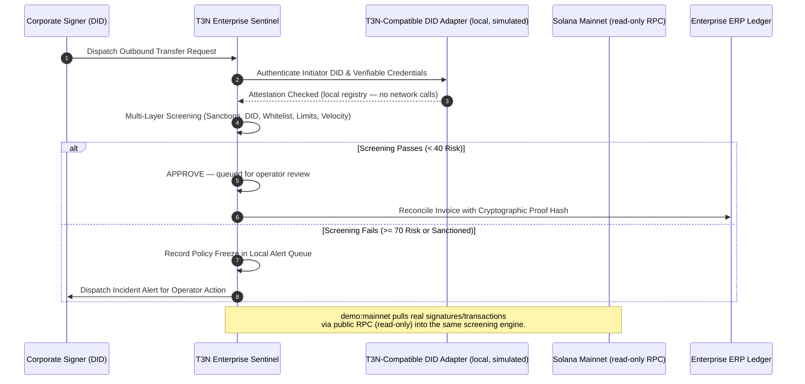

# Colosseum Crypto World's Fair — Entry Submission: T3N Enterprise Sentinel

**Project**: **T3N Enterprise Sentinel** — Autonomous Solana Treasury & Compliance Agent
**Author**: fliptrigga13 — [github.com/fliptrigga13/t3n-enterprise-sentinel](https://github.com/fliptrigga13/t3n-enterprise-sentinel)
**Submitter Wallet (Solana Mainnet)**: `CUbv4Hn4Y71ASzYn8j34YvFit55RbUPi6tLobVjmfc7i`
**Contact**: Telegram (`@wardumb`)

**Provenance**: Originally built for the Terminal 3 Network (T3N) Trusted Agent Build Challenge (Superteam Earn bounty — sponsor: Terminal 3 Network, [@terminal3io](https://terminal3.io)). Extended during the Colosseum hackathon window (Sep 14 – Oct 12, 2026) with a **read-only Solana mainnet screening mode** and a **polling watch mode**. The T3N challenge history is honest provenance, not the headline — this document is the Colosseum entry.

---

## 1. Project Overview & Enterprise Use Case

### The Problem
Enterprises and DAOs managing multi-million dollar digital asset treasuries on Solana face extreme governance and compliance liabilities:
- Compromised private keys or unauthorized employees draining funds.
- Inadvertent interaction with OFAC/sanctioned mixer contracts.
- Severe regulatory reporting overhead when reconciling thousands of high-speed Solana transactions with corporate ERP systems (NetSuite, SAP, QuickBooks).

### The Solution: T3N Enterprise Sentinel
**T3N Enterprise Sentinel** is an autonomous compliance and risk monitor for Solana enterprise treasuries. It cryptographically binds every transaction to a **T3N-compatible Decentralized Identity (DID)**, checks executive credentials, validates against sanctions lists, enforces daily spending velocity caps, and generates cryptographic audit proofs for enterprise accounting. In **polling watch mode** it screens new vault signatures every N seconds and prints alerts; in **read-only mainnet mode** it screens real on-chain transfers through the same 5-layer engine.

### Honest boundaries
- Sentinel **never holds private keys, never signs, and never broadcasts**. "APPROVE" means *queued for operator review*; "FREEZE_AND_ALERT" means *a policy-freeze record in the local alert queue* — not on-chain enforcement.
- The DID resolver is a **T3N-compatible local simulated adapter** (seeded in-memory registry, zero T3N network calls). A network-backed resolver is a planned drop-in behind the same interface.
- Sanctions screening uses a **2-entry demo list**; production path is the OFAC SDN feed or a commercial API (Chainalysis / TRM Labs).

---

## 2. Core Architecture & Workflow



---

## 3. Verified Execution & Test Proof

### Automated Test Suite: 100% Pass Rate (offline)
```text
$ npm test

 RUN  v2.1.9 /t3n-enterprise-sentinel

 ✓ tests/sentinel.test.ts (6 tests)
   ✓ authenticates legitimate officer DID with valid enterprise credentials
   ✓ rejects unregistered or revoked DIDs
   ✓ approves compliant enterprise transaction and reconciles with ERP invoice
   ✓ freezes transaction that exceeds daily treasury limit
   ✓ blocks transfer to known sanctioned / illicit address
   ✓ computes accurate audit statistics across processed transactions
 ✓ tests/mainnet-mapper.test.ts (2 tests)
   ✓ extracts only native-SOL system transfers and dedupes repeats
   ✓ maps lamports to SOL and preserves on-chain metadata

 Test Files  2 passed (2)
      Tests  8 passed (8)
```

### Live CLI Demonstration Run
```text
$ npm run demo

================================================================================
   🛡️  T3N ENTERPRISE SENTINEL: AUTONOMOUS SOLANA TREASURY & COMPLIANCE AGENT
   T3N-compatible DID interface — local simulated adapter (no live T3N network calls)
================================================================================

[STATUS] T3N-compatible DID resolver: local simulated adapter loaded.
[STATUS] Monitoring Vault: CORP_TREASURY_MAIN_CUbv4Hn4Y71ASzYn8j34YvFit55RbUPi6tLobVjmf
[STATUS] Daily Cap: 50.00 SOL | Current Vault Balance: 2500.00 SOL

--- [SCENARIO 1: LEGITIMATE ENTERPRISE OPEX TRANSFER] ---
Tx 1 Result: APPROVE (Risk Score: 0/100)
  DID Verified: true (Solana Global Enterprises Inc.)
  ERP Reconciliation: MATCHED [Proof: 05a0e60b9d8dd373...]

--- [SCENARIO 2: UNAUTHORIZED ROGUE TRANSFER ATTEMPT] ---
Tx 2 Result: ⛔ FREEZE_AND_ALERT (Risk Score: 100/100)
  Risk Level: CRITICAL
  Compliance Flags Triggered:
    - [MEDIUM] MISSING_T3N_DID: Transaction lacks cryptographic T3N DID signature attestation.
    - [HIGH] UNWHITELISTED_DESTINATION: Destination UNKNOWN_HACKER_WALLET is not in authorized treasury whitelist.
    - [CRITICAL] DAILY_LIMIT_EXCEEDED: Transfer of 120 SOL exceeds remaining daily limit of 32.25 SOL.
  Action Taken: Automatic Treasury Policy Freeze Dispatched.

--- [SCENARIO 3: SANCTIONED / OFAC ADDRESS ATTEMPT] ---
Tx 3 Result: ⛔ FREEZE_AND_ALERT (Risk Score: 100/100)
    - [CRITICAL] SANCTIONED_RECIPIENT: Target address matches known sanctioned/illicit list.
    - [HIGH] UNWHITELISTED_DESTINATION: Destination is not in authorized treasury whitelist.
  Action Taken: Alert Logged and Incident Dispatched.

================================================================================
                         AUDIT & COMPLIANCE SUMMARY
================================================================================
  Total Volume Inspected:  137.5 SOL
  Total Transactions:      3
  Approved & Reconciled:   1
  Automated Freezes:       2
  Compliance Pass Rate:    33.3%
  Active Security Alerts:  2
================================================================================
```
*(The ERP proof-hash prefix is a per-run SHA-256 over the transaction including its timestamp, so it differs run to run; all other values above are deterministic.)*

### Read-Only Mainnet Screening
`npm run demo:mainnet -- --address <any-solana-address>` pulls recent signatures/transactions for any address via public RPC and runs the same 5-layer compliance screen over the real transfers. No keypairs, no signing, no broadcasting. Verified end-to-end run (exit 0) below — in this sandbox the egress proxy intermittently reset RPC connections, so the run exercised the designed graceful-fallback path: a clear warning plus a labeled synthetic feed.
```text
$ npm run demo:mainnet

   🛡️  T3N ENTERPRISE SENTINEL — READ-ONLY MAINNET SCREENING MODE
   Public RPC only. No keypairs, no signing, no broadcasting.

[mainnet] target address: 11111111111111111111111111111111
[mainnet] rpc endpoint:  https://api.mainnet-beta.solana.com

⚠️  RPC unreachable (fetch failed).
   Running in SIMULATED mode with a synthetic feed — no live chain data.

  signature…        | from → to              | amount      | risk      | action           | flags
  SIMULATED_FEED_l… | SIM_TREA… → SIM_VEND… | 2.500000 SOL | risk 60/100 HIGH | FLAG_FOR_REVIEW | flags: MISSING_T3N_DID, UNWHITELISTED_DESTINATION
  SIMULATED_FEED_s… | SIM_TREA… → SIM_VEND… | 0.500000 SOL | risk 100/100 CRITICAL | FREEZE_AND_ALERT | flags: SANCTIONED_RECIPIENT, MISSING_T3N_DID, UNWHITELISTED_DESTINATION

  ── screening summary ──
  transfers screened: 2 | approved: 0 | frozen: 1 | flagged for review: 1

[mainnet] done. Sentinel made zero network calls beyond the public RPC reads above.
```
Live-path evidence (partial): direct `getSignaturesForAddress` / `getSlot` calls against `https://api.mainnet-beta.solana.com` from the same tree returned real mainnet data (slot 448,918,296; recent signatures e.g. `A8sux7ypMqMWQaXr…`). The end-to-end live screening run was not completable from the hardening sandbox because of the proxy flakiness described above — on a normal network the live path executes the same code path as the verified direct calls.

### Polling Watch Mode
`npm run watch -- --address <addr> --interval 30` establishes a baseline signature, then polls `getSignaturesForAddress` with `until` every N seconds, screens any new signatures' SOL transfers through the compliance engine, prints approve/flag/freeze alerts per transfer, and prints a summary on Ctrl+C. If the RPC is unreachable at startup it exits with a clear message rather than fabricating data (watch mode never falls back to simulated data — that would manufacture fake alerts).

*Implementation is complete and code-reviewed; a live multi-cycle run could not be demonstrated from the hardening sandbox because the egress proxy intermittently resets RPC connections (see mainnet note above). "24/7" uptime language has been deliberately removed from all docs pending a live soak test.*

---

## 4. Integration Status & Known Limitations

This section replaces the earlier T3N ADK feedback report — the code never integrated the live T3N network, so no integration-workflow claims are made here.

- **T3N / DID**: The `T3NClient` exposes a T3N-compatible DID interface (`resolveDID`, `verifyCredential`, `authenticateSigner`), but resolution is served by a **seeded in-memory registry** — zero HTTP calls, zero SDK usage. The `endpoint: https://api.terminal3.io/v1` config value is retained only as the seam where a network-backed adapter drops in. Any "live T3N integration" language has been removed from the codebase and docs.
- **Solana**: `demo:mainnet` and `--watch` are **read-only** (public RPC `getSignaturesForAddress` / `getParsedTransactions`). Nothing is signed or broadcast; there is deliberately no keypair handling anywhere in the codebase.
- **Sanctions**: 2-entry hardcoded demo set, labeled as such in code. Production path: OFAC SDN feed or Chainalysis / TRM Labs API.
- **Freezes & alerts**: local in-memory records for operator review, not on-chain enforcement and not dispatched anywhere.
- **Autonomy**: "autonomous" here means the engine screens and decides without human input per transaction; continuous operation is via `--watch` polling, not a 24/7 SLA — no such claim is made.

---

## 5. Provenance & Maintenance Notes

- Built by **fliptrigga13** (sole author, 39 commits) — originally for the T3N Trusted Agent Build Challenge (Superteam Earn), extended during the Colosseum Crypto World's Fair window with mainnet screening + watch mode.
- **Ease of maintenance**: minimal runtime dependencies (TypeScript + Node.js + `@solana/web3.js`); deterministic offline test suite; no secrets or env config required for any documented command.
- **Repository**: [https://github.com/fliptrigga13/t3n-enterprise-sentinel](https://github.com/fliptrigga13/t3n-enterprise-sentinel)
- **Docs**: `README.md` (this file's companion)
- **Contact**: Telegram (`@wardumb`)
